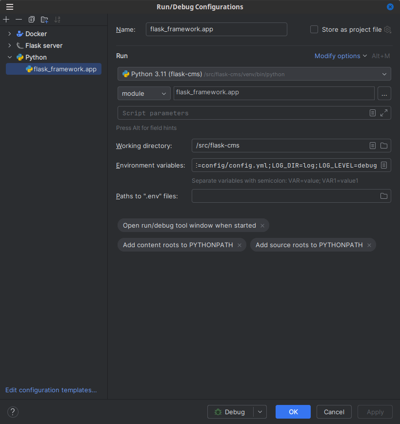
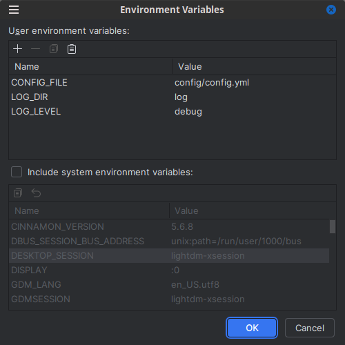

# Introduction

## Configuration

The base configuration file is located on the config dir.

You can add default database using only the configuration file.

### Default database with builtin driver in sqlalchemy 

```yaml
...
DATABASE: 
  default: mysql
  mysql: 
    driver: mysql+pymysql
    user: "replace this with your database user"
    password: "replace this with your database user's password"
    database: "replace this with your database name"
    address: "replace this with your hostname"
    models: "mysql (python module that require to be put under Models.Persistent module)"
    readonly: false
...
```

### Default database with non builtin driver in sqlalchemy 

```yaml
...
DATABASE:
  default: informix
  informix:
    driver: informix
      user: "replace this with your database user"
      password: "replace this with your database user's password"
      database: "replace this with your database name"
      address: "replace this with your hostname"
      models: "informix (python module that require to be put under Models.Persistent module)"
      params:
        SERVER: "replace with your server name"
        CLIENT_LOCALE: "replace with your client locale"
        DB_LOCALE: "replace with your server locale"
      dialects:
        informix: 
          module: IfxAlchemy.IfxPy
          class: IfxDialect_IfxPy
        informix.IfxPy: 
          module: IfxAlchemy.IfxPy
          class: IfxDialect_IfxPy
        informix.pyodbc: 
          module: IfxAlchemy.pyodbc
          class: IfxDialect_pyodbc
      readonly: false
...
```
__"params"__ are parameters that need to be send within the connection to the database.
In that example using informix database __"SERVER"__, __"CLIENT_LOCALE"__ and __"DB_LOCALE"__ are required parameters for the connection to the database.

__"dialects"__ are the python modules configuration to translate models into sql statements to query the database

### Multiple databases

```yaml
...
DATABASE:
  db01:
    ...
  db02:
    ...
...
```


### Adding users session

To enable sessions in the server you need to add __"APP_KEY"__ and __"SESSION"__ into the __"SERVER_DATA"__ section in the configuration file

__"APP_KEY"__ : random string value (keep that secret)

__"SESSION"__ : string value, possible values are [__"filesystem"__, __"memcahed"__, __"redis"__, __"mongodb"__, __"sqlalchemy"__]

### Using filesystem, redis or memcached based sessions

```yaml
...
SERVICES:
  redis:
    HOST: localhost
    PORT: 6379
  filesystem:
    PATH: sessions
  memcached:
    HOST: localhost
    PORT: 11211
```

### Using mongodb or sqlalchemy based sessions

Session based on sqlalchemy will use the default configured database

```yaml
...
DATABASES:
  default: mysql
  mysql:
    driver: mysql+pymysql
    user: "replace this with your database user"
    password: "replace this with your database user's password"
    database: "replace this with your database name"
    address: "replace this with your hostname"
    models: "mysql (python module that require to be put under Models.Persistent module)"
    readonly: false
  mongodb:
    driver: mongodb
    user: "replace this with your database user"
    password: "replace this with your database user's password"
    database: "replace this with your database name"
    address: "replace this with your hostname"
    collection: "replace this with your collection name for the sessions"
    models: "mongodb (python module that require to be put under Models.Persistent module)"
    readonly: false
...
```

### Adding cors to the server

```yaml
...
FLASK:
  CONFIG:
    CORS_ORIGINS:
      - "http://localhost"    
    CORS_ALLOW_HEADERS: 
      - Content-Type 
      - Authorization
    CORS_ALWAYS_SEND: true
    CORS_AUTOMATIC_OPTIONS: true
    CORS_EXPOSE_HEADERS: Authorization
    CORS_INTERCEPT_EXCEPTIONS: true
    CORS_MAX_AGE: null
    CORS_METHODS: 
      - GET
      - HEAD
      - POST
      - OPTIONS
    CORS_SEND_WILDCARD: false
    CORS_SUPPORTS_CREDENTIALS: true
    CORS_VARY_HEADER: true
    ...
...
``` 

## Creating server routes

There are 3 files where you could register your flask server routes, You could find these file under the src/Server folder:

* Errors:

All the server http error code must be registered inside the __init__ method of the ErrorHandler.py file.

Example:
```python
server.register_error_handler(500, Controllers.Web.HTTP50XController.error500)
```

* Web based http file routes:

All the web based http routes must be registered inside the __init__ method of the Web.py file.

Example:
```python
server.add_url_rule('/', 'home', Controllers.Web.HomeController.index, methods=['GET'])
```

* Rest api routes:

All the Rest API based routes must be registered inside the __init__ method of the WS.py file.


Example:
```python
server.add_url_rule('/api/', 'api', Controllers.WS.ApiController.index, methods=['GET'])
```

## Creating controllers:

* Web based http file controllers:

All web based http file controllers must be placed under the ```Controllers.Web``` module.

The class based controllers that you register into the app must be imported into the ```__init__.py``` file of the ```Controller.Web``` module.

The file based that contain your view functions must  must also be inmported into the ```__init__.py``` file of the ```Controller.Web``` module.


* Rest api controllers:

All Rest API based controllers must be placed under the src/Controllers/WS folder.

The class based controllers that you register into the app must be imported into the ```__init__.py``` file of the ```Controller.Web``` module.

The file based that contain your view functions must  must also be inmported into the ```__init__.py``` file of the ```Controller.Web``` module.

## Creating models:


you can create SQLAlchemy models by creating a new module under the ```Models.Persistent``` module and place each models inside your module that you previously created. 

The models that you register into the app must be an ```Database.Model ``` or ```Database.get_models_by_name('replace that with your database connection name')``` object, you could import this object using the following line into your database model:


```python
from Database import Database
```

All models must be imported inside the ```__init__.py``` of your base module and you must import this module in the ```__init__.py``` of the ```Models.Persistent``` module

## Creating scheduling tasks:

Tasks are some python code that are running at specific interval time. These task must be placed inside the src/Task folder.
After that you must add these line inside the src/server.py file to enable your task function:

```python
    Server.Process.add_task("Task.YourFileOrClass.YourStaticMethodOrClassMethod", second=30)
```

Note the task you are registering must be before the line:

```python
    Server.Process.start(args)
```


## Static folder:

The src/static folder contains all static file for your web based application.

## Template folder:

The src/template folder contains layouts and templates file for your web based application.
Those files are content configurable, you can also import layout inside the your template file, it allow you to have only content editable part into your template file.

---

# Using docker-compose file:

* First start of the flask server:

```bash
docker-compose up 
```

* To start the flask server:

```bash
docker-compose start 
```

* To restart the flask server

```bash
docker-compose restart 
```

* To shutdown the flask server:

```bash
docker-compose stop 
```

---

# Running on local desktop:

We assume that your system already had python v3+ and pip v3+ installed.

* installation:

```bash 
git clone https://github.com/frederickney/flask-framework.git
cd flask-framework
pip3 install
```

or 
```pip 
pip install flask_framework
```

* First start of the flask server

```bash
mkdir log
```

* On every startup of the flask server in standalone

```bash 
export LOG_FILE=log/process.log
```

```bash 
export CONFIG_FILE=config/config.yml
```

* Starting the flask server attached to an ide such as PyCharm

Setup the configuration as seen bellow in the screenshots





### :warning: Issue raised, it is no longer working attached to ide: [link to issue](https://github.com/frederickney/flask-framework/issues/2/)

* Starting the flask server in standalone

```bash 
python -m flask_framework.server
```

* On every startup of the flask server in standalone

```bash 
export LOG_DIR=log/
```

```bash 
export CONFIG_FILE=config/config.yml
```

* Starting the flask server with gunicorn and workers process

```bash 
python -m flask_framework.wsgi
```

---

# LICENSE

#### See [License file](LICENSE)